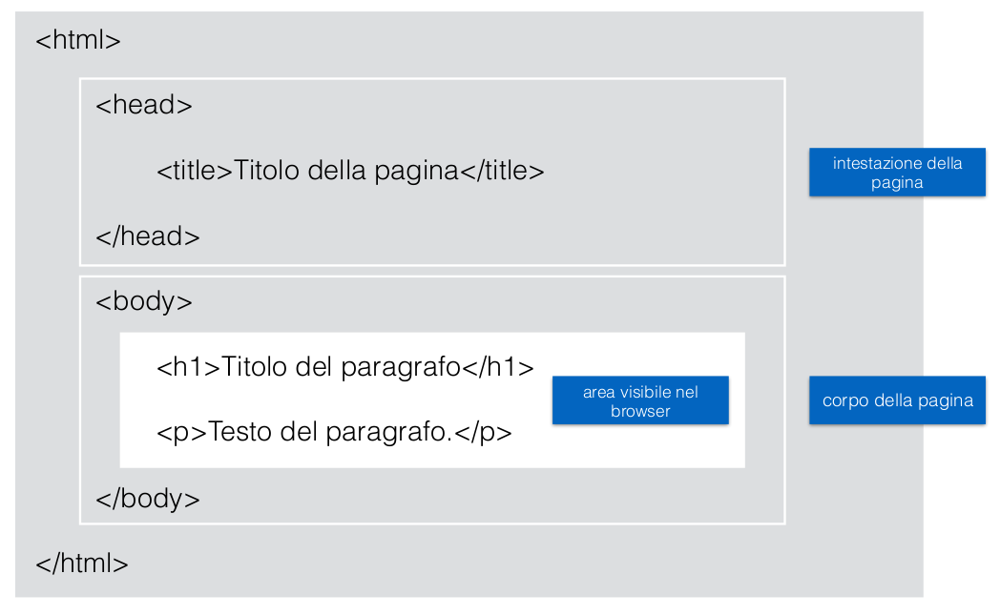

# Cos'è l'HTML?
* HTML è il linguaggio di markup standard per la creazione di pagine Web.
* HTML sta per Hyper Text Markup Language
* HTML descrive la struttura delle pagine Web usando il markup
* Gli elementi HTML sono gli elementi costitutivi delle pagine HTML
* Gli elementi HTML sono rappresentati da tag ``<nometag>``
* I tag HTML etichettano parti di contenuto come "heading", "paragraph",
"table" e così via
* I browser non visualizzano i tag HTML, ma li usano per presentare il
contenuto della pagina

Tag HTML
* I tag HTML sono nomi di elementi circondati da
parentesi angolari:
* ``
`` contenuto... ``
``
* Il primo tag in una coppia è il tag di apertura, il
secondo tag è il tag di chiusura
* Il tag di chiusura è scritto come il tag di inizio, ma
con una forward slash “/“ inserita prima del nome
del tag

Esempio di documento HTML
``<!DOCTYPE html>`` ``<!DOCTYPE html>`` è la dichiarazione che definisce
il tipo di documento, nel caso dell’esempio: HTML5
``<html>`` ``<html>`` è l'elemento principale di una pagina HTML
``<head>``
``<head>`` contiene meta informazioni sul documento
``<title>``Titolo della pagina``</title>``
``<title>`` specifica un titolo per il documento
``</head>``
``<body>``
``<body>`` contiene il contenuto della pagina visibile
``<h1>``Titolo del paragrafo``</h1>`` ``<h1>`` definisce un titolo di primo livello
``
``Testo del paragrafo.``
`` ``
`` definisce un paragrafo
``</body>``
``</html>``

---

## Struttura di una pagina HTML

---
## Visualizzazione del documento: il browser
* Lo scopo di un browser è di leggere documenti HTML e visualizzarli.
* Il browser non visualizza i tag HTML, ma li utilizza per determinare come
visualizzare il documento:

---
## ``<! DOCTYPE>``
La dichiarazione `<!DOCTYPE>` rappresenta il tipo di documento e aiuta i browser a interpretare,
e quindi visualizzare correttamente le pagine Web.
Deve apparire solo una volta, nella parte superiore della pagina (prima di qualsiasi tag HTML).
La dichiarazione `<!DOCTYPE>` per HTML5 è:
`<!DOCTYPE html>`

---
## ``<head>``
L'elemento `<head>` è un contenitore per i metadati. I metadati HTML
sono dati relativi al documento HTML. I metadati non vengono
visualizzati.
L'elemento `<head>` è posizionato tra il tag `<html>` e il tag `<body>`:
`<!DOCTYPE html>`
`<html>`
`<head>`
`<title>`La mia pagina web`</title>`
`<meta charset = "UTF-8">`
`</head>`
`<body>`
i metadati generalmente definiscono: il titolo del documento, il set di
caratteri, gli stili, i collegamenti, gli script e altre meta informazioni.

---
## Strumenti
* Le pagine Web possono essere create e modificate utilizzando un semplice editor di testo
come Notepad (PC) o TextEdit (Mac).
* Tuttavia, per la scrittura di codice HTML raccomandiamo editor HTML professionali come
“Sublime Text”, Atom, Visual Studio ...
* Gli editor professionali aiutano nella scrittura e lettura del codice e offrono funzioni di ricerca e
sostituzione molto potenti.
* Strumenti di sviluppo del browser
* disegnare wireframe: applicazione (pencil), https://pencil.evolus.vn/
* disegnare wireframe: servizio web (esempio), https://wireframe.cc/
* utilità:
* https://caniuse.com/
* https://validator.w3.org/

---
## Elementi HTML
Un elemento HTML di solito consiste in un tag di inizio e un tag di
fine, con il contenuto inserito all’interno:
`< tagname >` contenuto ... `< / tagname >`
L' elemento HTML comprende tutto, dal tag di inizio al tag di fine:
`
` Il mio primo paragrafo. `
`
L' elemento `
` definisce un paragrafo . Ha un tag iniziale `
` e
un tag finale `
`.
Il contenuto dell'elemento è: Il mio primo paragrafo.

---
## Elementi vuoti
Gli elementi HTML senza contenuto sono chiamati elementi vuoti.
` ` è un elemento vuoto senza un tag di chiusura (` ` definisce un'interruzione
di riga, `
` definisce una riga, `` per inserire un’immagine...).
Gli elementi vuoti possono essere "chiusi" aggiungendo il forward slash prima
della parentesi di chiusura del tag, in questo modo: ` `.
HTML5 non richiede la chiusura di elementi vuoti. Ma se si desidera una convalida
più rigorosa del documento, è necessario chiudere tutti gli elementi HTML
correttamente.
Elementi HTML nidificati
Gli elementi HTML possono essere nidificati (gli elementi possono contenere
elementi). Tutti i documenti HTML sono costituiti da elementi HTML nidificati.
Come vedremo ci sono alcune eccezioni.

---
## Elementi Block
Un elemento a livello di blocco inizia sempre su una nuova riga e occupa
l'intera larghezza disponibile (si estende a sinistra e a destra fino ad
occupare tutto lo spazio disponibile).
L'elemento `<h1>` è un elemento a livello di blocco.
`<h1>`Ciao,`</h1>`
`<h2>`mondo!`</h2>`

---
## Elementi a livello di blocco in HTML:
...|...|...
---|---|---
`<address>`|`<article>`|`<aside>`
`<blockquote>`|`<canvas>`|`<dd>`
`
`|`<dl>`|`<dt>`
`<fieldset>`|`<figcaption>`|`<figure>`
`<footer>`|`<form>`|`<h1>`-`<h6>`
`<header>`|`
`|`<li>`
`<main>`|`<nav>`|`<noscript>`
`<ol>`|`<output>`|`
`
`<pre>`|`<section>`|`<table>`
`<tfoot>`|`<ul>`|`<video>`

---
## Elementi Inline
Gli elementi del tipo inline si dispongono uno di fianco all’altro e occupano solo la
larghezza necessaria per mostrare il contenuto.
Di seguito è rappresentato un elemento `<a>` incorporato all'interno di un
paragrafo.
`
``<a href="http://www.saggiamente.com">` Vai al sito
saggiamente.com`</a>``
`

---

Elementi|in|linea|HTML
---|---|---|---
`<a>`|`<input>`|`<cite>`|`<select>`
`<abbr>`|`<kbd>`|`<code>`|`<small>`
`<acronym>`|`<label>`|`<dfn>`|``
`<b>`|`<map>`|`<em>`|`<strong>`
`<bdo>`|`<object>`|`<i>`|``
`<big>`|`<q>`|``|``
` `|`<samp>`|`<textarea>`|`<tt>`
`<button>`|`<script>`|`<time>`|`<var>`

La maggior parte dei browser visualizza l'elemento `` come elemento inline-block.

---
## Attributi HTML
* Tutti gli elementi HTML possono avere attributi
* Gli attributi forniscono informazioni aggiuntive su
un elemento
* Gli attributi sono sempre specificati nel tag di inizio
* Gli attributi di solito vengono rappresentati da
coppie nome / valore tipo: nome = "valore"

---
## lang
La lingua viene dichiarata con l'attributo lang dichiarato all’interno del tag `<html>`.
Dichiarare una lingua è importante per le applicazioni di accessibilità (screen
reader) e per i motori di ricerca:
`<!DOCTYPE html>`
`<html lang="en-US">`
`<body>`
...
`</body>`
`</html>`
Le prime due lettere specificano la lingua (en). Se c'è un dialetto, usa altre due
lettere (US) *.
Una pagina italiana avrà la dichiarazione seguente:
`<html lang="it">`
* https://www.w3schools.com/tags/ref_language_codes.asp

---

## href

I collegamenti HTML sono definiti con il tag `<a>`. L'indirizzo del link è specificato
nell’attributo href (Hypertext REFerence):
`<a href="https://www.miosito.it">`Questo è un il collegamento al mio sito`</a>`

---

## src

Le immagini HTML sono definite con il tag ``.
Il nome del file dell'immagine viene specificato nell’attributo src:
``

---

## width, height

Le immagini in HTML hanno un set di attributi relativi alla dimensione che specificano la larghezza e l'altezza dell'immagine:
``
I valori relativi alle dimensioni sono da intendersi in pixel: larghezza = "800" significa larghezza 800 px.

---

## alt

L' attributo alt specifica un testo alternativo da utilizzare, quando un'immagine non può essere visualizzata.

Il valore dell'attributo può essere letto dagli screen reader. In questo modo, qualcuno che "ascolta" la pagina Web, ad esempio una persona ipovedente, può capire cosa rappresenta l'elemento.

``

---

## title

title viene aggiunto ad un elemento. Il valore dell'attributo verrà visualizzato come suggerimento (testo in fumetto) quando si passa il mouse sopra l’elemento:

`
`Il mio paragrafo`
`
`<a href="https://www.miosito.it" title="Visita il mio sito">Questo è un il collegamento al mio sito</a>`

---

## style

L' attributo style è usato per specificare lo stile di un elemento, come il colore, il carattere, la
dimensione, l’allineamento, ecc.

`
`Questo paragrafo è rosso!`
`

Uso delle virgolette per i valori dell’attributo
Lo standard HTML5 non richiede virgolette attorno ai valori degli
attributi.
L' attributo href può essere scritto senza virgolette:
`<a href=https://www.mioblog.it>`
`<a href="https://www.mioblog.it">`
È necessario usare le virgolette. L’esempio seguente non mostrerà
correttamente l'attributo titolo, perché contiene uno spazio:
`
`

---

## Virgolette singole o doppie?

Le doppie virgolette attorno ai valori degli attributi sono le
più comuni in HTML, ma è possibile utilizzare anche
virgolette singole.
In alcune situazioni, quando il valore dell'attributo contiene
doppie virgolette, è necessario utilizzare le virgolette singole:
`
`
Oppure:
`
`

---

## Commenti HTML

I tag di commento vengono utilizzati per inserire commenti nel codice sorgente HTML.
Puoi aggiungere commenti al tuo sorgente HTML usando la seguente sintassi:
`<!-- Qui puoi inserire i tuoi commenti -->`
Il punto esclamativo (!) va inserito solo nel tag di apertura.
I commenti non vengono visualizzati dal browser quindi possono aiutare a documentare il
codice HTML.
Con i commenti puoi inserire notifiche e promemoria nel tuo codice:
`
`Questo è un paragrafo`
`
`<!-- Ricordarsi di aggiungere un pulsante “more info” -->`
I commenti sono anche ottimi per il debug, perché puoi commentare le righe di codice
HTML, una alla volta, per cercare errori:
`<!--
``
-->`

---

## Elementi HTML
Heading (intestazioni)
I titoli sono definiti con i tag da `<h1>` a `<h6>`.
`<h1>`definisce la voce più importante. `<h6>`definisce l'intestazione meno
importante.
`<h1>`Titolo 1`</h1>`
`<h2>`Titolo 2`</h2>`
`<h3>`Titolo 3`</h3>`
`<h4>`Titolo 4`</h4>`
`<h5>`Titolo 5`</h5>`
`<h6>`Titolo 6`</h6>`

---

## Le intestazioni sono importanti

I motori di ricerca utilizzano i titoli per indicizzare la struttura e il contenuto delle tue pagine web.
Gli utenti scorrono velocemente le pagine in base ai titoli. È importante utilizzare i titoli per mostrare la struttura del documento.
le intestazioni `<h1>` dovrebbero essere usate per le intestazioni principali, seguite dal `<h2>`, poi le meno importanti `<h3>` e così via.
Nota: utilizzare le intestazioni HTML solo per i titoli. Non usare le intestazioni per rendere il testo di dimensioni maggiori o in grassetto.

### Dimensione del carattere delle Intestazioni

Ogni `<h>` ha una dimensione predefinita. Tuttavia, è possibile specificare la
dimensione per qualsiasi intestazione con l'attributo style, utilizzando la proprietà
CSS font-size:
`<h1 style="font-size:36px;">`Titolo 1`</h1>`

`
`
Con HTML, non puoi modificare l'output aggiungendo spazi extra o linee extra nel tuo codice HTML.
Il browser rimuoverà spazi aggiuntivi e linee aggiuntive quando viene visualizzata la pagina:

---

## ``
``

L'elemento `
` (HTML Content Division) è spesso usato come contenitore per altri elementi HTML.
L'elemento `
` non ha attributi obbligatori, ma style, class e id vengono utilizzati frequentemente.

Se utilizzato insieme ai CSS, l'elemento `
` può essere utilizzato per creare stili di contenuto:
`
`
`<h2>`Roma`</h2>`
`
`Roma è la capitale d’Italia. È la città più turistica e popolare in Italia, ci vivono circa 3 milioni di abitanti.`
`
`
`

---

## ````

L'elemento `` non ha attributi obbligatori, ma style, classe e id vengono
utilizzati frequentemente.
Se utilizzato insieme ai CSS, l'elemento `` può essere utilizzato per
modificare parti del testo:
`<h1>`Un titolo``importante```</h1>`
o per contenere un’immagine/icona:
`
`
``
``
`` Lorem ipsum dolor sit...
`
`